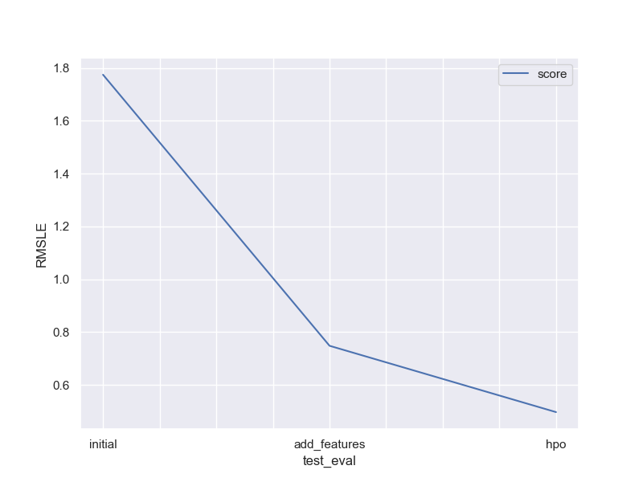

# Report: Predict Bike Sharing Demand with AutoGluon Solution
#### Carl Centola

## Initial Training
### What did you realize when you tried to submit your predictions? What changes were needed to the output of the predictor to submit your results?
The model will occasionally output negative values, which is impossible given our domain. In order for Kaggle to accept or submission, we need to figure out a way to remove negative values. I chose to withe a function that converts negative values to 0.

### What was the top ranked model that performed?
The `WeightedEnsemble_L3` made it to the top of my leader board with a `score_val` of `-50.672962`.

## Exploratory data analysis and feature creation
### What did the exploratory analysis find and how did you add additional features?
My analysis showed that features such as `weather` and `holiday` were qualitative and should be treated as categorical variables, so I converted them to such. 

I was also able to identify `datetime` as a feature that we could break down into `month`, `day`, `hour`, and `day_of_week` to inspect our data for seasonality. My initial assumption was that riders used these bikes as more of a mode of transportation during weekday commutes (6am - 9am & 4pm - 6pm) and more of a recreational vehicle on weekends. If my assumption is correct, we would likely see that demand peaks during commutes on weekdays and that demand is relatively consistent for weekends.

I used this trend to create an additional feature, `demand`, that categorized the demand at the time of the rental on a scale of 0 - 3:
- 0: Little to no demand
- 1: Normal demand
- 2: Increased demand
- 3: Surging demand

### How much better did your model preform after adding additional features and why do you think that is?
Adding the datetime breakout and `demand` features to our dataset improved overall model performance. The root mean squared logarithmic error (RMSLE) on the test set decreased from `1.78` to `0.75`.

## Hyper parameter tuning
### How much better did your model preform after trying different hyper parameters?
For the third test I manually defined the search space for neural networks and GBM models. For the training, the model performed significantly worse with our best RMSE increasing from `29.88` to `59.29`. However, when it was applied to the test data the performance improved from an RMSLE perspective of `0.75` to `0.5`. 

### If you were given more time with this dataset, where do you think you would spend more time?
I would choose to spend more time with the hyperparameter tuning for this project. Hyperparameter tuning is still very new to me, so admittedly I was forced to rely heavily on documentation and the wisdom of the crowd to truly wrap my head around how to setup the tuning as well as the impact it had on model performance 

I would also like to get more data surrounding the high volume pickup and drop-off locations as well as the usage time. Based on the description of the dataset, these features are commonly available with bike sharing data, but they were missing from our training and testing data. If the goal is to respond to demand rather than simply predict it, understanding bike rental hot spots and how long riders travel when renting these bicycles could be valuable information. 

### Create a table with the models you ran, the hyperparameters modified, and the kaggle score.
|model|hpo1|hpo2|hpo3|score|
|--|--|--|--|--|
|initial|Default Settings|Default Settings|Default Settings|1.77468|
|add_features|Default Settings|Default Settings|Default Settings|0.74802|
|hpo|NN OPTIONS: {num_epochs: 30, learning_rate: [1e-5, 1e-1], activation: [relu, softrelu, sigmoid, tanh], dropout_prob: [0.0, 0.5]|GBM options: {num_boost_round: 100, num_leaves: [26,66]}| Default Settings |0.49680|

### Create a line plot showing the top model score for the three (or more) training runs during the project.

### Create a line plot showing the top kaggle score for the three (or more) prediction submissions during the project.

## Summary
Given the available data, we see that it is possible to predict bike sharing demand with some level of accuracy. The exploratory analysis and the resulting feature engineering made a significant impact on our model's performance over simply training the model on the raw data. This highlights the fact that given more time and additional data, there are likely even more improvements we could make to our model.
